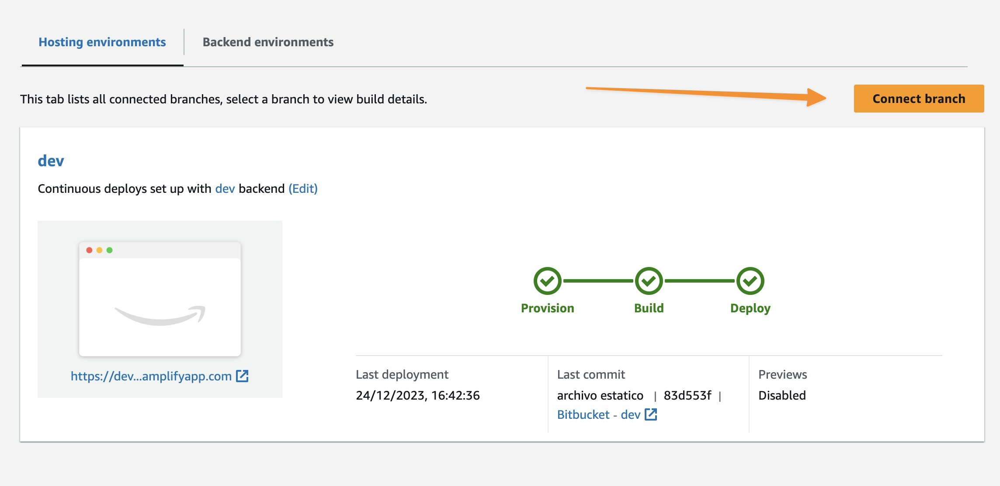
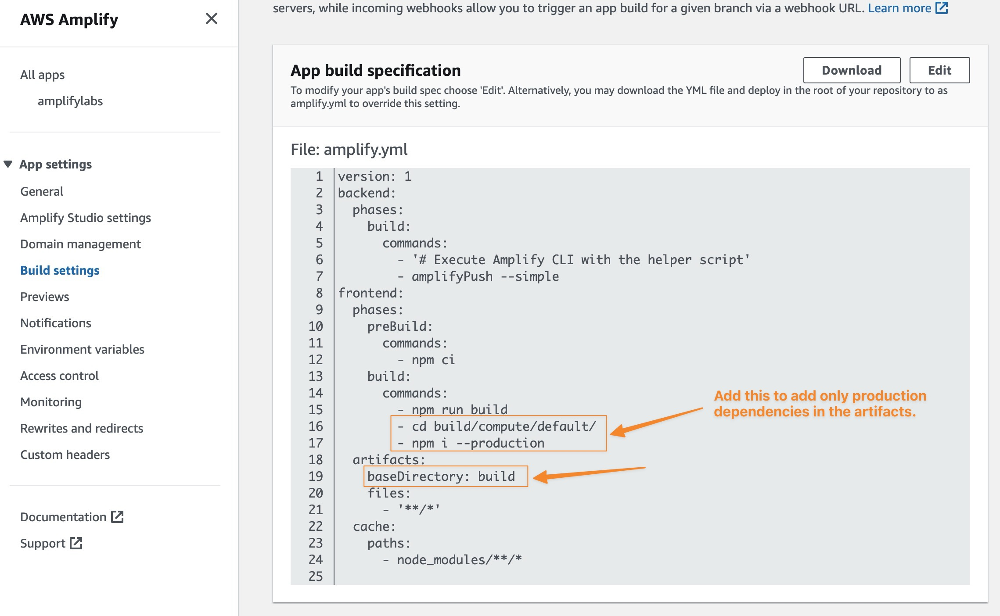
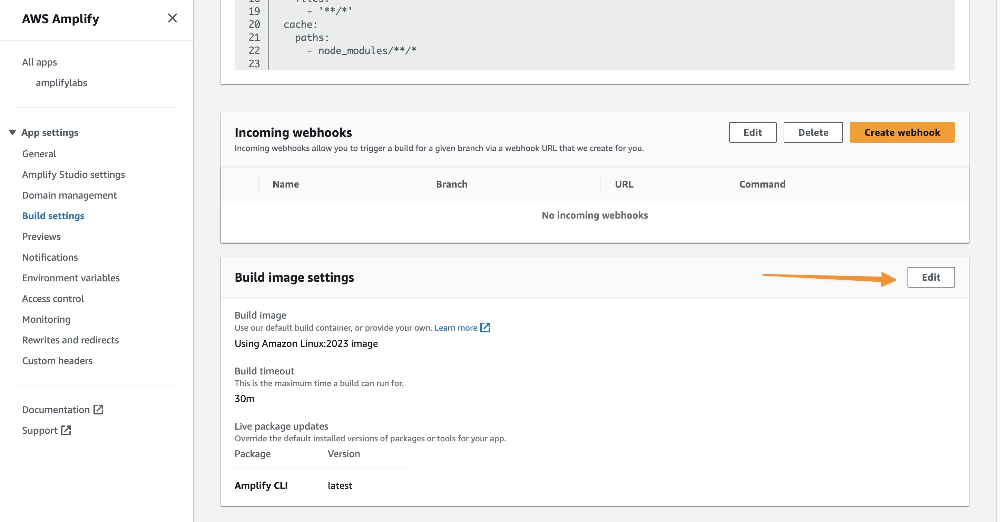
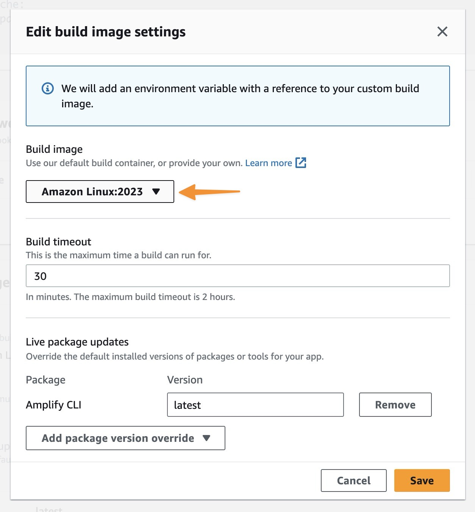

# amplify-adapter

[Adapter](https://kit.svelte.dev/docs/adapters) for SvelteKit apps to Amplify Host CI/CD.

Este paquete se creó para adaptar el paquete @sveltejs/node-adapter para su uso con CI/CD en AWS Amplify + SSR. Este paquete incluye los siguientes cambios:

## Usage

- Install with npm or yarn:

```bash
npm install --save-dev amplify-adapter
```

- Add the adapter to your `svelte.config.js`:

```js
// svelte.config.js
import adapter from 'amplify-adapter';
```

## Amplify CI/CD

- Connect a branch to your Amplify App Hosting for CI/CD (setup default values).



- Go to `App settings > Build settings > App build specification` and set Artifact folder to `build` (default adapter output folder).



- At `App settings > Build settings > Build image settings` clic `Edit` Button, and change `Build image` to `Amazon Linux:2023`.





## License

[MIT](LICENSE)
