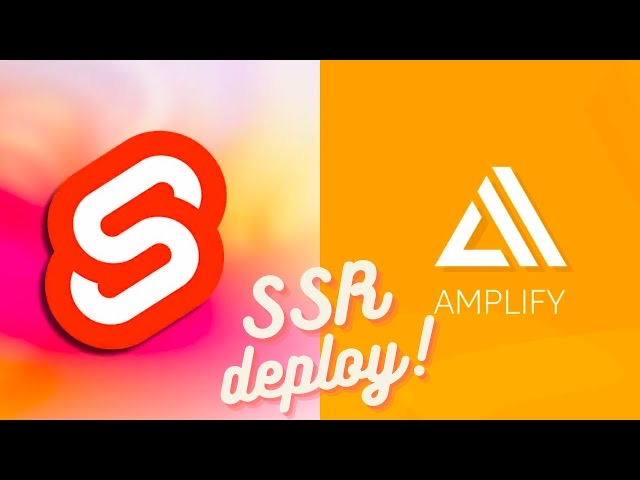
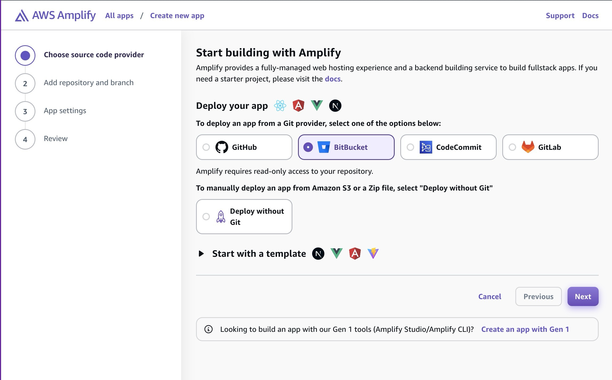
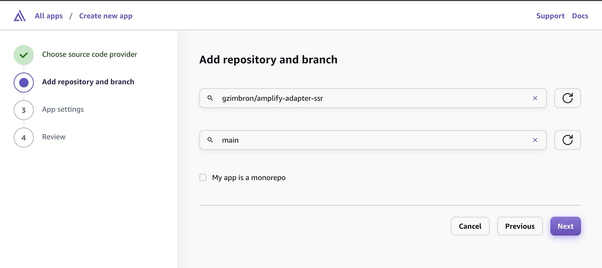
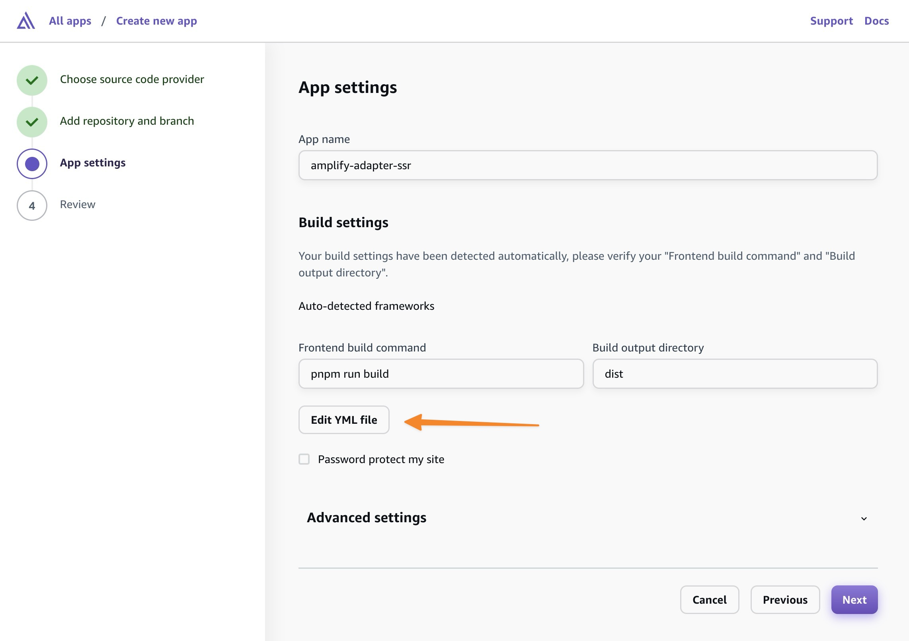
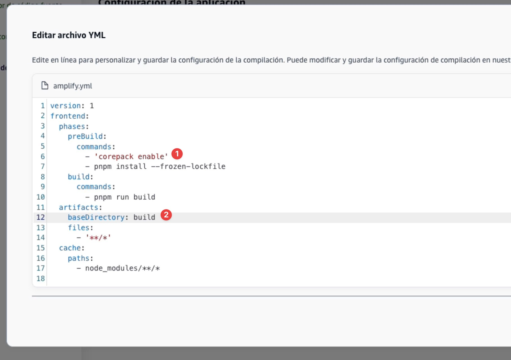

# amplify-adapter

[Adapter](https://kit.svelte.dev/docs/adapters) for SvelteKit apps to Amplify Host CI/CD.

Este paquete se creó para adaptar el paquete @sveltejs/node-adapter para su uso con CI/CD en AWS Amplify + SSR. Este paquete incluye los siguientes cambios:

Limitations:

- Artifacts size limit: 200 MB

## Video tutorial

[](https://youtu.be/YGgJgq2LLpE)

### Official documentation on AWS Amplify

[https://docs.aws.amazon.com/amplify/latest/userguide/get-started-sveltekit.html](https://docs.aws.amazon.com/amplify/latest/userguide/get-started-sveltekit.html)

## Sveltekit amplify adapter installation

- Install with npm, pnpm or yarn:

```bash
npm install --save-dev amplify-adapter
```

- Add the adapter to your `svelte.config.js`:

```js
// svelte.config.js
import adapter from 'amplify-adapter';
```

## Amplify Hosting Integration (CI/CD)

- Create a new app in Amplify Console, choose your git provider and click `Next`.



- Select your repository and branch, and click `Next`.



- Click `Edit YML` button:



- Set Artifact base directory to `build` and add the following lines to `frontend -> build` phase:

```yaml
- cd build/compute/default/
- npm i --omit=dev
```



```yml
version: 1
frontend:
  phases:
    preBuild:
      commands:
        - 'npm i'
    build:
      commands:
        - 'npm run build'
        - 'cd build/compute/default/'
        - 'npm i --omit=dev'
  artifacts:
    baseDirectory: build
    files:
      - '**/*'
  cache:
    paths:
      - node_modules/**/*
```

- Click `Next` to `Review` your app configuration and click `Save and Deploy`.


## License

[MIT](LICENSE)
